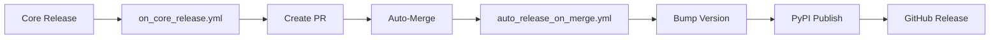

# Automated Dependency Updates & Releases

## ✅ Complete Automation Chain

This repository has a fully automated workflow for handling Core dependency updates:



## 📋 Workflows

### 1. `on_core_release.yml`
- **Trigger**: `workflow_dispatch` (manual) or `repository_dispatch` (from Core)
- **Actions**:
  - Updates `market-data-core` dependency in `pyproject.toml` and `requirements.txt`
  - Creates PR with automated labels
  - Enables auto-merge (squash)
- **Key**: Uses `REPO_TOKEN` (PAT) to allow workflow chaining

### 2. `auto_release_on_merge.yml`
- **Trigger**: Push to `master` when `pyproject.toml` changes
- **Actions**:
  - Bumps patch version (via `scripts/bump_version.sh`)
  - Creates git tag
  - Builds and publishes to PyPI
  - Creates GitHub Release with artifacts
- **Key**: Uses `PYPI_API_TOKEN` for PyPI uploads

## 🔐 Required Secrets

| Secret | Scope | Purpose |
|--------|-------|---------|
| `REPO_TOKEN` | repo, workflows | PAT for creating PRs that trigger other workflows |
| `PYPI_API_TOKEN` | N/A | Production PyPI upload token |
| `TEST_PYPI_API_TOKEN` | N/A | Test PyPI upload token (optional) |

## 🚀 Testing the Automation

```bash
# Test with an existing Core version
gh workflow run on_core_release.yml --ref master -f version=1.2.12

# Expected:
# 1. PR created and merged
# 2. Version auto-bumped
# 3. Published to PyPI
# 4. GitHub Release created
```

## 📦 Deploying to Other Repos

To replicate this automation in `market-data-pipeline` or `market-data-orchestrator`:

1. **Copy files**:
   - `.github/workflows/on_core_release.yml`
   - `.github/workflows/auto_release_on_merge.yml`
   - `scripts/bump_version.sh`

2. **Update workflow references**:
   - Change `market-data-store` to target repo name in release bodies

3. **Set secrets**:
   - `REPO_TOKEN` - Same PAT can be used across repos
   - `PYPI_API_TOKEN` - Create separate token for each package

4. **Enable settings**:
   - Settings → Actions → General → "Allow GitHub Actions to create and approve pull requests"
   - Settings → Branches → Enable auto-merge for the default branch

## 🧠 Key Technical Details

### Why REPO_TOKEN instead of GITHUB_TOKEN?

GitHub security: workflows triggered by `GITHUB_TOKEN` cannot trigger other workflows. Using a PAT (`REPO_TOKEN`) allows the PR merge from `on_core_release.yml` to trigger `auto_release_on_merge.yml`.

### Version Bumping

The `scripts/bump_version.sh` script:
- Handles both GNU and BSD `sed` (cross-platform)
- Bumps patch version only (can be modified for minor/major)
- Robust error handling with `set -euo pipefail`
- Outputs only version number to stdout (for capture in workflows)

### Duplicate Tag Protection

The auto-release workflow checks for existing tags before creating new ones, preventing accidental overwrites or re-publishes.

## 📊 Monitoring

View workflow runs:
```bash
# List all workflow runs
gh run list --limit 10

# View specific workflow
gh workflow view on_core_release.yml

# Check auto-release runs
gh run list --workflow="Auto-Release on Core Dependency Update"
```

## ✅ Verification

After a successful run, verify:
```bash
# Check latest version
grep 'version = ' pyproject.toml

# Check dependency
grep 'market-data-core' pyproject.toml

# View latest release
gh release view --json tagName,publishedAt,url

# Check PyPI
# Visit https://pypi.org/project/market-data-store/
```
